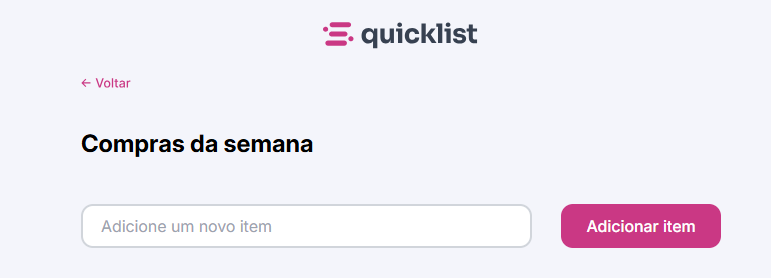

<h1 align="center"> Lista de Compras </h1>

  Uma aplicação web simples e funcional para organizar sua lista de compras da semana.

  <a href="#-tecnologias">Tecnologias</a>&nbsp;&nbsp;&nbsp;|&nbsp;&nbsp;&nbsp;
  <a href="#-projeto">Projeto</a>&nbsp;&nbsp;&nbsp;|&nbsp;&nbsp;&nbsp;
  <a href="#-layout">Layout</a>&nbsp;&nbsp;&nbsp;|&nbsp;&nbsp;&nbsp;
  <a href="#memo-licença">Licença</a>

  

 

  

## 🚀 Tecnologias

Esse projeto foi desenvolvido para praticar a manipulação do DOM com JavaScript:

- HTML5
- CSS3 
- JavaScript

## 💻 Projeto

A **Lista de Compras** permite que o usuário adicione itens para montar seu carrinho da semana. O foco do desenvolvimento foi a interatividade e o feedback visual para o usuário.

Funcionalidades implementadas:
- **Adicionar Itens:** Criação dinâmica de elementos HTML (`createElement`).
- **Validação de Input:** Uso de **Regex** para permitir apenas letras e espaços, impedindo a entrada de números ou caracteres especiais.
- **Remover Itens:** Exclusão de elementos da lista com um clique.
- **Feedback Visual:** Exibição temporária de um alerta de confirmação ("O item foi removido da lista") que desaparece automaticamente após alguns segundos (`setTimeout`).
- **Customização:** Checkboxes estilizados com CSS para substituir o padrão do navegador.

🔗 [Acesse o projeto online](https://miqueiassantoss.github.io/lista-de-compras/)

## 🔖 Layout

O design é limpo e focado na usabilidade, com cores vibrantes para ações principais e uma estrutura responsiva que funciona bem em dispositivos móveis e desktops.

## 📝 Licença

Esse projeto está sob a licença MIT.

---

  Feito por <a href="https://github.com/miqueiassantoss">Miqueias Santos</a>

